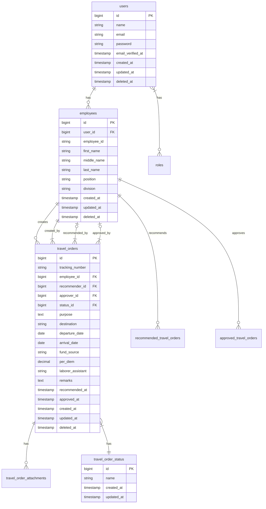

# DENR Travel Order System - Database Documentation

## Database Schema

### Tables

#### 1. `users`
- **Description**: Stores user authentication information
- **Fields**:
  - `id` (bigint, primary key, auto-increment)
  - `name` (string, 255)
  - `email` (string, 255, unique)
  - `email_verified_at` (timestamp, nullable)
  - `password` (string, 255)
  - `remember_token` (string, 100, nullable)
  - `created_at` (timestamp, nullable)
  - `updated_at` (timestamp, nullable)
  - `deleted_at` (timestamp, nullable, soft delete)
- **Relationships**:
  - Has one `employee`
  - Has many `travel_orders`
  - Has many `approvals` (as recommender or approver)
  - Belongs to many `roles`

#### 2. `roles`
- **Description**: Defines user roles and permissions
- **Fields**:
  - `id` (bigint, primary key, auto-increment)
  - `name` (string, 255, unique)
  - `guard_name` (string, 255)
  - `created_at` (timestamp, nullable)
  - `updated_at` (timestamp, nullable)
- **Default Roles**:
  - Admin
  - Approver
  - Recommender
  - User

#### 3. `model_has_roles`
- **Description**: Pivot table for user-role many-to-many relationship
- **Fields**:
  - `role_id` (bigint, foreign key to `roles.id`)
  - `model_type` (string, 255)
  - `model_id` (bigint)
- **Primary Key**: `[role_id, model_id, model_type]`

#### 4. `employees`
- **Description**: Stores detailed employee information
- **Fields**:
  - `id` (bigint, primary key, auto-increment)
  - `user_id` (bigint, foreign key to `users.id`)
  - `employee_id` (string, 50, unique)
  - `first_name` (string, 255)
  - `middle_name` (string, 255, nullable)
  - `last_name` (string, 255)
  - `suffix` (string, 10, nullable)
  - `position` (string, 255, nullable)
  - `division` (string, 255, nullable)
  - `section` (string, 255, nullable)
  - `contact_number` (string, 20, nullable)
  - `created_at` (timestamp, nullable)
  - `updated_at` (timestamp, nullable)
  - `deleted_at` (timestamp, nullable, soft delete)
- **Relationships**:
  - Belongs to `users`
  - Has many `travel_orders`
  - Has many `recommended_travel_orders` (as recommender)
  - Has many `approved_travel_orders` (as approver)

#### 5. `travel_order_status`
- **Description**: Tracks the status of travel orders
- **Fields**:
  - `id` (bigint, primary key, auto-increment)
  - `name` (string, 50, unique)
  - `description` (text, nullable)
  - `created_at` (timestamp, nullable)
  - `updated_at` (timestamp, nullable)
- **Default Statuses**:
  - Draft
  - For Recommendation
  - For Approval
  - Approved
  - Disapproved
  - Cancelled
  - Completed

#### 6. `travel_orders`
- **Description**: Main table for travel order requests
- **Fields**:
  - `id` (bigint, primary key, auto-increment)
  - `tracking_number` (string, 50, unique)
  - `employee_id` (bigint, foreign key to `employees.id`)
  - `recommender_id` (bigint, foreign key to `employees.id`, nullable)
  - `approver_id` (bigint, foreign key to `employees.id`, nullable)
  - `status_id` (bigint, foreign key to `travel_order_status.id`)
  - `purpose` (text)
  - `destination` (string, 255)
  - `departure_date` (date)
  - `arrival_date` (date)
  - `fund_source` (string, 255, nullable)
  - `per_diem` (decimal(15, 2, nullable)
  - `laborer_assistant` (string, 255, nullable)
  - `remarks` (text, nullable)
  - `recommender_remarks` (text, nullable)
  - `approver_remarks` (text, nullable)
  - `recommended_at` (timestamp, nullable)
  - `approved_at` (timestamp, nullable)
  - `created_at` (timestamp, nullable)
  - `updated_at` (timestamp, nullable)
  - `deleted_at` (timestamp, nullable, soft delete)
- **Relationships**:
  - Belongs to `employee`
  - Belongs to `recommender` (employee)
  - Belongs to `approver` (employee)
  - Belongs to `status`
  - Has many `travel_order_attachments`
  - Has many `notifications`

#### 7. `travel_order_attachments`
- **Description**: Stores file attachments for travel orders
- **Fields**:
  - `id` (bigint, primary key, auto-increment)
  - `travel_order_id` (bigint, foreign key to `travel_orders.id`)
  - `file_name` (string, 255)
  - `file_path` (string, 255)
  - `file_type` (string, 100)
  - `file_size` (bigint)
  - `created_at` (timestamp, nullable)
  - `updated_at` (timestamp, nullable)
- **Relationships**:
  - Belongs to `travel_order`

#### 8. `notifications`
- **Description**: System notifications for users
- **Fields**:
  - `id` (uuid, primary key)
  - `type` (string, 255)
  - `notifiable_type` (string, 255)
  - `notifiable_id` (bigint)
  - `data` (json)
  - `read_at` (timestamp, nullable)
  - `created_at` (timestamp, nullable)
  - `updated_at` (timestamp, nullable)
- **Indexes**:
  - `notifications_notifiable_type_notifiable_id_index`

#### 9. `password_resets`
- **Description**: Password reset tokens
- **Fields**:
  - `email` (string, 255, indexed)
  - `token` (string, 255)
  - `created_at` (timestamp, nullable)
- **Indexes**:
  - `password_resets_email_index`

#### 10. `personal_access_tokens`
- **Description**: API access tokens
- **Fields**:
  - `id` (bigint, primary key, auto-increment)
  - `tokenable_type` (string, 255)
  - `tokenable_id` (bigint)
  - `name` (string, 255)
  - `token` (string, 64, unique)
  - `abilities` (text, nullable)
  - `last_used_at` (timestamp, nullable)
  - `expires_at` (timestamp, nullable)
  - `created_at` (timestamp, nullable)
  - `updated_at` (timestamp, nullable)
- **Indexes**:
  - `personal_access_tokens_tokenable_type_tokenable_id_index`
  - `remarks` (text, nullable)
  - `created_at` (timestamp)
  - `updated_at` (timestamp)
- **Relationships**:
  - Belongs to `travel_orders`
  - Belongs to `users` (as recommender)
  - Belongs to `users` (as approver)

#### 7. `notifications`
- **Description**: System notifications for users
- **Fields**:
  - `id` (bigint, primary key)
  - `user_email` (string, foreign key to `users.email`)
  - `travel_order_id` (bigint, foreign key to `travel_orders.id`)
  - `status_id` (bigint, foreign key to `travel_order_status.id`)
  - `type` (enum: 'Approved', 'Disapproved', 'Cancelled')
  - `message` (text)
  - `is_read` (boolean, default: false)
  - `created_at` (timestamp)
  - `updated_at` (timestamp)
- **Relationships**:
  - Belongs to `users`
  - Belongs to `travel_orders`
  - Belongs to `travel_order_status`

## Entity Relationship Diagram (ERD)

```
+-------------+       +------------------+       +-----------------+
|   users     |       |   employees      |       |  travel_orders  |
+-------------+       +------------------+       +-----------------+
| email (PK)  |<------| email (FK)       |<------| employee_email  |
| name        |       | first_name      |       | destination     |
| password    |       | last_name       |       | purpose         |
| ...         |       | position        |       | departure_date  |
## Entity Relationship Diagram (ERD)



## Database Migrations

All database tables are managed through Laravel migrations. To run the migrations:

```bash
php artisan migrate
```

To refresh the database with seed data:

```bash
php artisan migrate:fresh --seed
```

## Seeded Data

The following data is seeded by default:

1. **Roles**:
   - Admin
   - Approver
   - Recommender
   - User

2. **Travel Order Statuses**:
   - Draft
   - For Recommendation
   - For Approval
   - Approved
   - Disapproved
   - Cancelled
   - Completed

3. **Default Admin User**:
   - Email: admin@denr.gov.ph
   - Password: password
       |                   |                   | status_id (FK)  |
       |             +-----------------+       | ...             |
       |             |  approvals      |       +-----------------+  +---------------------+
       |             +-----------------+               ^  ^         |  travel_order_status|
       |             | travel_order_id |<--------------+  |         +---------------------+
       |             | recommender_email|                  +---------| id (PK)             |
       |             | approver_email  |                  |         | name                |
       |             | rec_status      |       +-----------------+  | created_at          |
       |             | appr_status     |       |  notifications  |  | updated_at          |
       |             | rec_date        |<------| travel_order_id |  +---------------------+
       |             | appr_date       |       | user_email (FK) |
       |             | remarks         |       | status_id (FK)  |
       |             | ...             |       | type            |
       |             +-----------------+       | message         |
       |                   ^                   | is_read         |
       |                   |                   | ...             |
       |                   |                   +-----------------+
       |                   |
       |             +-----------------+
       |             |      roles     |
       |             +-----------------+
       +-------------| id (PK)        |
                     | name           |
                     | description    |
                     | created_at     |
                     | updated_at     |
                     +-----------------+

Key Relationships:
- users 1:1 employees (users.email = employees.email)
- users 1:N travel_orders (users.email = travel_orders.employee_email)
- travel_orders 1:1 approvals (travel_orders.id = approvals.travel_order_id)
- users 1:N approvals as recommender (users.email = approvals.recommender_email)
- users 1:N approvals as approver (users.email = approvals.approver_email)
- travel_orders 1:N notifications (travel_orders.id = notifications.travel_order_id)
- travel_order_status 1:N travel_orders (travel_order_status.id = travel_orders.status_id)
- travel_order_status 1:N notifications (travel_order_status.id = notifications.status_id)
- users 1:N notifications (users.email = notifications.user_email)
```

## Indexes

### Primary Keys
- All tables have an auto-incrementing `id` as primary key

### Foreign Keys
1. `employees`:
   - `email` references `users(email)`
   - `recommender_email` references `employees(email)`
   - `approver_email` references `employees(email)`
2. `travel_orders`:
   - `employee_email` references `employees(email)`
   - `status_id` references `travel_order_status(id)`
3. `approvals`:
   - `travel_order_id` references `travel_orders(id)`
   - `recommender_email` references `users(email)`
   - `approver_email` references `users(email)`
4. `notifications`:
   - `user_email` references `users(email)`
   - `travel_order_id` references `travel_orders(id)`
   - `status_id` references `travel_order_status(id)`

## Data Seeding

The database includes seeders for initial data:
- `TravelOrderStatusSeeder`: Populates the `travel_order_status` table with default status values
- `DatabaseSeeder`: Main seeder that calls other seeders in order

## Migration Notes

1. All tables include `created_at` and `updated_at` timestamps
2. Foreign key constraints are set to `onDelete('cascade')` for related records
3. String fields use appropriate lengths based on their content
4. Nullable fields are used for optional information
5. Enums are used for fields with a fixed set of possible values

## Data Types

- **Strings**: Used for names, emails, and short text
- **Text**: Used for longer content like purposes and remarks
- **Date/Datetime**: Used for tracking dates and times
- **Decimal**: Used for monetary values like per diem
- **Boolean**: Used for flags like `is_read` in notifications
- **Enum**: Used for status fields with fixed options

## Security Considerations

1. Email is used as a foreign key in multiple tables for user identification
2. Sensitive data like passwords are hashed (handled by Laravel's authentication)
3. All database queries should use prepared statements to prevent SQL injection
4. Input validation is implemented at the application level
