# DENR Travel Order Management System

A comprehensive web-based solution designed to streamline the travel order process for the Department of Environment and Natural Resources (DENR). This system digitizes and automates the entire travel order workflow, from submission to approval, ensuring efficiency, transparency, and compliance with government regulations.

## 🎯 Purpose & Objectives

- **Digital Transformation**: Replace paper-based travel order processing with a secure, centralized digital platform
- **Workflow Automation**: Automate the approval hierarchy and notification system
- **Real-time Tracking**: Provide real-time status updates for all travel orders
- **Compliance & Reporting**: Ensure compliance with government travel policies and generate audit trails
- **Accessibility**: Enable secure access from any device with role-based permissions

## ✨ Key Features

- **Travel Order Creation & Submission**
  - Intuitive form for creating new travel orders
  - Support for multiple destinations and date ranges
  - Automatic calculation of travel duration
  - File attachments for supporting documents

- **Multi-level Approval Workflow**
  - Department-level recommendation
  - HR/Administration approval
  - Real-time status tracking

- **Comprehensive Dashboard**
  - Overview of pending actions
  - Quick access to recent travel orders
  - Status indicators and priority flags

- **Mobile-Responsive Design**
  - Fully functional on all device sizes
  - Touch-friendly interface for field personnel

- **Security & Compliance**
  - Role-based access control
  - Digital signatures
  - Complete approval trail

## Requirements

- PHP 8.2 or higher
- Composer
- Node.js 18+ & NPM 9+
- MySQL 8.0 or higher

## 🛠 Tech Stack

### Backend
- **PHP 8.2** - Server-side programming language
- **Laravel 12** - PHP web application framework
- **Laravel Breeze** - Authentication scaffolding
- **Laravel Sanctum** - API token authentication
- **MySQL 8.0+** - Relational database

### Frontend
- **HTML5 & CSS3** - Markup and styling
- **JavaScript (ES6+)** - Client-side scripting
- **Alpine.js** - Minimal framework for JavaScript behavior
- **Tailwind CSS** - Utility-first CSS framework
- **Vite** - Next Generation Frontend Tooling
- **Axios** - Promise based HTTP client

### Development Tools
- **Composer** - PHP dependency manager
- **NPM** - Node package manager
- **Git** - Version control system

## 🔄 Workflow

```mermaid
flowchart TD
    A[📋 Employee Creates Travel Order] --> B{🔄 Status:\n   For Recommendation}
    
    B -->|✅ Recommended by\n    Department Head| C{📝 Status:\n   For Approval}
    
    C -->|✅ Approved by\n    HR/Admin| D{✔️ Status:\n   Approved}
    
    C -->|❌ Rejected| E[↩️ Returned to Employee\n    for Revision]
    
    E --> A
    D --> F[✈️ Travel is Completed]
    F --> G[📄 Employee Submits\n    Completion Report]
    G --> H[🏁 Travel Order\n    Completed]

    %% Styling for better readability
    classDef default fill:#f8f9fa,stroke:#333,stroke-width:1.5px,color:#333,font-family:Arial
    classDef process fill:#e9f7fe,stroke:#0288d1,stroke-width:2px,color:#01579b
    classDef decision fill:#fff8e1,stroke:#ffa000,stroke-width:2px,color:#e65100
    classDef success fill:#e8f5e9,stroke:#388e3c,stroke-width:2px,color:#1b5e20
    classDef warning fill:#fff3e0,stroke:#f57c00,stroke-width:2px,color:#e65100
    classDef danger fill:#ffebee,stroke:#d32f2f,stroke-width:2px,color:#b71c1c
    
    class A,G process
    class B,C,D decision
    class H success
    class E danger
    class F warning
```



### Workflow Description
1. **Travel Order Creation**
   - Employee fills out the travel order form with trip details
   - System assigns "For Recommendation" status

2. **Department Review**
   - Department Head reviews the request
   - Can either:
     - **Recommend**: Sends to HR/Admin for approval
     - **Reject**: Returns to employee with feedback

3. **HR/Admin Approval**
   - HR/Admin reviews the recommended travel order
   - Can either:
     - **Approve**: Travel order is approved
     - **Reject**: Returns to employee with feedback

4. **Travel Execution**
   - Employee completes the travel
   - Submits completion report if required
   - System marks travel order as completed

## Installation

1. Clone the repository:
   ```bash
   git clone https://github.com/brandon3sican/denr-travel-order.git
   cd denr-travel-order
   ```

2. Install PHP dependencies:
   ```bash
   composer install
   ```

3. Install NPM dependencies:
   ```bash
   npm install
   ```

4. Copy the environment file:
   ```bash
   cp .env.example .env
   ```

5. Generate application key:
   ```bash
   php artisan key:generate
   ```

6. Configure your `.env` file with your database credentials:
   ```env
   DB_CONNECTION=mysql
   DB_HOST=127.0.0.1
   DB_PORT=3306
   DB_DATABASE=denr_travel_order
   DB_USERNAME=your_db_username
   DB_PASSWORD=your_db_password
   ```

7. Run database migrations:
   ```bash
   php artisan migrate --seed
   ```

8. Create storage link for file uploads:
   ```bash
   php artisan storage:link
   ```

9. Build assets:
   ```bash
   npm run build
   ```

9. Start the development server:
   ```bash
   php artisan serve
   ```

10. Access the application at `http://localhost:8000`

## Default Login

- **Email**: admin@example.com
- **Password**: password

## License

This project is open-source and available under the [MIT License](LICENSE).
