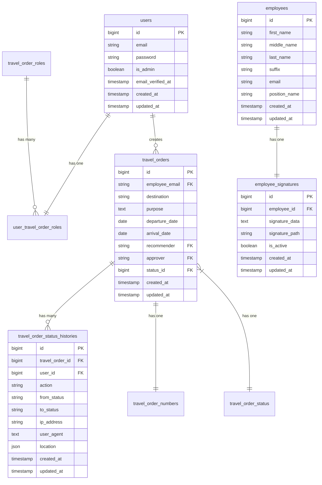

# Database Schema Documentation

## Overview
This document outlines the database structure for the DENR Travel Order Management System. The database is designed to manage employees, travel orders, approvals, and related data.

## Database Schema Diagram

*Note: This diagram shows the main entities and their relationships. For a complete schema reference, see the detailed table documentation below.*

## Database Tables

### 1. `users`
Stores user authentication and basic information.

| Column | Type | Description |
|--------|------|-------------|
| id | bigint | Primary key |
| email | string | Unique email address |
| email_verified_at | timestamp | Email verification timestamp |
| password | string | Hashed password |
| is_admin | boolean | Admin flag |
| remember_token | string | For "remember me" functionality |
| created_at | timestamp | Record creation timestamp |
| updated_at | timestamp | Record update timestamp |

### 2. `emp_status`
Tracks employee status types.

| Column | Type | Description |
|--------|------|-------------|
| id | bigint | Primary key |
| name | string | Status name |
| desc | string | Status description |
| created_at | timestamp | Record creation timestamp |
| updated_at | timestamp | Record update timestamp |

### 3. `employees`
Stores detailed employee information.

| Column | Type | Description |
|--------|------|-------------|
| id | bigint | Primary key |
| first_name | string | Employee's first name |
| middle_name | string | Employee's middle name |
| last_name | string | Employee's last name |
| suffix | string | Name suffix (e.g., Jr., Sr.) |
| sex | string | Gender |
| email | string | Unique email address |
| contact_no | string | Contact number |
| emp_status | string | Employment status |
| position_name | string | Job position |
| assignment_name | string | Department/Assignment |
| div_sec_unit | string | Division/Section/Unit |
| created_at | timestamp | Record creation timestamp |
| updated_at | timestamp | Record update timestamp |

### 4. `travel_order_roles`
Defines different roles in the travel order workflow, used for access control and permissions.

| Column | Type | Description |
|--------|------|-------------|
| id | bigint | Primary key |
| name | string | Unique role name (e.g., 'approver', 'recommender', 'requester') |
| description | text | Detailed description of the role and its permissions (nullable) |
| created_at | timestamp | Record creation timestamp |
| updated_at | timestamp | Record update timestamp |

**Constraints:**
- Unique constraint on `name`

### 5. `travel_order_status`
Tracks different statuses of travel orders.

| Column | Type | Description |
|--------|------|-------------|
| id | bigint | Primary key |
| name | string | Status name (unique) |
| created_at | timestamp | Record creation timestamp |
| updated_at | timestamp | Record update timestamp |

### 6. `travel_orders`
Main table for travel order records, storing all travel request details and workflow information.

| Column | Type | Description |
|--------|------|-------------|
| id | bigint | Primary key |
| employee_email | string | Foreign key to users.email (employee who requested the travel) |
| employee_salary | decimal(10,2) | Employee's salary at time of request |
| destination | string | Travel destination |
| purpose | text | Detailed purpose of travel |
| departure_date | date | Scheduled departure date |
| arrival_date | date | Scheduled return date |
| recommender | string | Foreign key to users.email (person who can recommend) |
| approver | string | Foreign key to users.email (person who can approve) |
| appropriation | string | Budget appropriation code |
| per_diem | decimal(10,2) | Daily allowance amount |
| laborer_assistant | decimal(10,0) | Labor/assistant cost |
| remarks | string | Additional notes (nullable) |
| status_id | bigint | Foreign key to travel_order_status |
| created_at | timestamp | Record creation timestamp |
| updated_at | timestamp | Record update timestamp |

**Foreign Keys:**
- `employee_email` references `users.email` (cascade delete)
- `status_id` references `travel_order_status.id` (cascade delete)
- `recommender` references `users.email` (cascade delete)
- `approver` references `users.email` (cascade delete)

### 7. `travel_order_numbers`
Manages unique travel order numbers.

| Column | Type | Description |
|--------|------|-------------|
| id | bigint | Primary key |
| travel_order_number | string | Unique travel order number |
| travel_order_id | bigint | Foreign key to travel_orders |
| created_at | timestamp | Record creation timestamp |
| updated_at | timestamp | Record update timestamp |

### 8. `user_travel_order_roles`
Junction table for user-role relationships.

| Column | Type | Description |
|--------|------|-------------|
| id | bigint | Primary key |
| user_id | bigint | Foreign key to users |
| travel_order_role_id | bigint | Foreign key to travel_order_roles |
| created_at | timestamp | Record creation timestamp |
| updated_at | timestamp | Record update timestamp |

### 9. `employee_signatures`
Stores and manages digital signatures for employees used in approvals and authorizations.

| Column | Type | Description |
|--------|------|-------------|
| id | bigint | Primary key |
| employee_id | bigint | Foreign key to employees (unique) |
| signature_data | text | Base64 encoded signature data (nullable) |
| signature_path | string | Path to stored signature file if saved as file (nullable) |
| mime_type | string | MIME type of the signature (default: 'image/png') |
| is_active | boolean | Whether the signature is active (default: true) |
| created_at | timestamp | Record creation timestamp |
| updated_at | timestamp | Record update timestamp |

**Constraints:**
- Unique constraint on `employee_id` (one signature per employee)

### 10. `travel_order_status_histories`
Tracks detailed audit trail of all status changes and actions for travel orders.

| Column | Type | Description |
|--------|------|-------------|
| id | bigint | Primary key |
| travel_order_id | bigint | Foreign key to travel_orders |
| user_id | bigint | Foreign key to users (nullable) |
| action | string | Type of action (approve, reject, update_status) |
| from_status | string | Previous status before change |
| to_status | string | New status after change |
| ip_address | string(45) | IP address of the user who made the change |
| user_agent | text | User agent string from the request |
| device | string | Detected device information |
| browser | string | Detected browser information |
| location | json | Geographical location data (lat, lng, accuracy) |
| client_meta | json | Additional client metadata |
| created_at | timestamp | Record creation timestamp |
| updated_at | timestamp | Record update timestamp |

**Indexes:**
- `travel_order_id` (index)
- `user_id` (index)

## Relationships

1. `users` has many `user_travel_order_roles`
2. `travel_order_roles` has many `user_travel_order_roles` (defines which users have which roles)
3. `users` (as employee) has many `travel_orders` (through employee_email)
4. `travel_orders` has one `travel_order_numbers`
5. `travel_orders` has many `travel_order_status_histories` (audit trail of all status changes and actions)
6. `travel_order_status` has many `travel_orders` (tracks current status of each travel order)
7. `employees` has one `employee_signatures` (one-to-one relationship, one signature per employee)

## Indexes

- All tables have primary key indexes on `id`
- `employee_signatures` has a unique index on `employee_id`
- `travel_order_status_histories` has additional indexes on `travel_order_id` and `user_id` for performance
- Unique indexes on:
  - `users.email`
  - `employees.email`
  - `employees.contact_no`
  - `travel_order_roles.name`
  - `travel_order_status.name`
  - `travel_order_numbers.travel_order_number`

## Notes

- Timestamps (`created_at` and `updated_at`) are automatically managed by Laravel's Eloquent ORM.
- Foreign key constraints are enforced at the database level with cascade delete where appropriate.
- The `travel_orders` table is central to the application, containing all travel request details.
- Financial fields use `decimal` type for precise monetary calculations.
- The `travel_order_roles` table is crucial for the role-based access control (RBAC) system.
  - Common roles include:
    - `requester` - Can create and submit travel orders
    - `recommender` - Can review and recommend travel orders
    - `approver` - Can approve or reject travel orders
    - `admin` - Full system access
- Soft deletes may be implemented in the future, but are not currently used.
- The system maintains referential integrity through foreign key constraints on email addresses in the `users` table.
