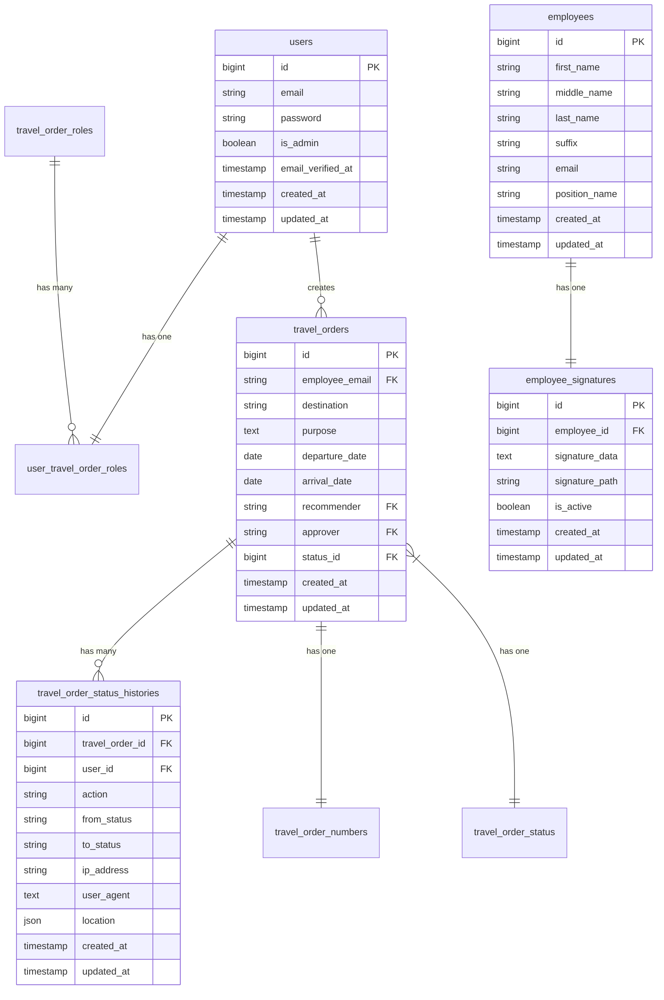

# DENR Travel Order Management System - Database Documentation

## Table of Contents
- [Overview](#overview)
- [Database Schema](#database-schema)
  - [Schema Diagram](#database-schema-diagram)
  - [Tables](#database-tables)
  - [Relationships](#relationships)
  - [Indexes](#indexes)
- [Data Dictionary](#data-dictionary)
- [Data Types and Constraints](#data-types-and-constraints)
- [Version History](#version-history)
- [Notes](#notes)

## Overview
This document provides comprehensive documentation for the DENR Travel Order Management System database. The database is designed to manage employees, travel orders, approvals, and related data with a focus on data integrity, performance, and auditability.

## Database Schema

### Database Schema Diagram

*Note: This diagram shows the main entities and their relationships. For a complete schema reference, see the detailed table documentation below.*

### Database Tables

### 1. `users`
Stores user authentication and basic information.

| Column | Type | Description |
|--------|------|-------------|
| id | bigint | Primary key |
| email | string | Unique email address |
| email_verified_at | timestamp | Email verification timestamp |
| password | string | Hashed password |
| is_admin | boolean | Admin flag |
| remember_token | string | For "remember me" functionality |
| created_at | timestamp | Record creation timestamp |
| updated_at | timestamp | Record update timestamp |

### 2. `emp_status`
Tracks employee status types.

| Column | Type | Description |
|--------|------|-------------|
| id | bigint | Primary key |
| name | string | Status name |
| desc | string | Status description |
| created_at | timestamp | Record creation timestamp |
| updated_at | timestamp | Record update timestamp |

### 3. `employees`
Stores detailed employee information.

| Column | Type | Description |
|--------|------|-------------|
| id | bigint | Primary key |
| first_name | string | Employee's first name |
| middle_name | string | Employee's middle name |
| last_name | string | Employee's last name |
| suffix | string | Name suffix (e.g., Jr., Sr.) |
| sex | string | Gender |
| email | string | Unique email address |
| contact_no | string | Contact number |
| emp_status | string | Employment status |
| position_name | string | Job position |
| assignment_name | string | Department/Assignment |
| div_sec_unit | string | Division/Section/Unit |
| created_at | timestamp | Record creation timestamp |
| updated_at | timestamp | Record update timestamp |

### 4. `travel_order_roles`
Defines different roles in the travel order workflow, used for access control and permissions.

| Column | Type | Description |
|--------|------|-------------|
| id | bigint | Primary key |
| name | string | Unique role name (e.g., 'approver', 'recommender', 'requester') |
| description | text | Detailed description of the role and its permissions (nullable) |
| created_at | timestamp | Record creation timestamp |
| updated_at | timestamp | Record update timestamp |

**Constraints:**
- Unique constraint on `name`

### 5. `travel_order_status`
Tracks different statuses of travel orders.

| Column | Type | Description |
|--------|------|-------------|
| id | bigint | Primary key |
| name | string | Status name (unique) |
| created_at | timestamp | Record creation timestamp |
| updated_at | timestamp | Record update timestamp |

### 6. `travel_orders`
Main table for travel order records, storing all travel request details and workflow information.

| Column | Type | Description |
|--------|------|-------------|
| id | bigint | Primary key |
| employee_email | string | Foreign key to users.email (employee who requested the travel) |
| employee_salary | decimal(10,2) | Employee's salary at time of request |
| destination | string | Travel destination |
| purpose | text | Detailed purpose of travel |
| departure_date | date | Scheduled departure date |
| arrival_date | date | Scheduled return date |
| recommender | string | Foreign key to users.email (person who can recommend) |
| approver | string | Foreign key to users.email (person who can approve) |
| appropriation | string | Budget appropriation code |
| per_diem | decimal(10,2) | Daily allowance amount |
| laborer_assistant | decimal(10,0) | Labor/assistant cost |
| remarks | string | Additional notes (nullable) |
| status_id | bigint | Foreign key to travel_order_status |
| created_at | timestamp | Record creation timestamp |
| updated_at | timestamp | Record update timestamp |

**Foreign Keys:**
- `employee_email` references `users.email` (cascade delete)
- `status_id` references `travel_order_status.id` (cascade delete)
- `recommender` references `users.email` (cascade delete)
- `approver` references `users.email` (cascade delete)

### 7. `travel_order_numbers`
Manages unique travel order numbers.

| Column | Type | Description |
|--------|------|-------------|
| id | bigint | Primary key |
| travel_order_number | string | Unique travel order number |
| travel_order_id | bigint | Foreign key to travel_orders |
| created_at | timestamp | Record creation timestamp |
| updated_at | timestamp | Record update timestamp |

### 8. `user_travel_order_roles`
Junction table for user-role relationships.

| Column | Type | Description |
|--------|------|-------------|
| id | bigint | Primary key |
| user_id | bigint | Foreign key to users |
| travel_order_role_id | bigint | Foreign key to travel_order_roles |
| created_at | timestamp | Record creation timestamp |
| updated_at | timestamp | Record update timestamp |

### 9. `employee_signatures`
Stores and manages digital signatures for employees used in approvals and authorizations.

| Column | Type | Description |
|--------|------|-------------|
| id | bigint | Primary key |
| employee_id | bigint | Foreign key to employees (unique) |
| signature_data | text | Base64 encoded signature data (nullable) |
| signature_path | string | Path to stored signature file if saved as file (nullable) |
| mime_type | string | MIME type of the signature (default: 'image/png') |
| is_active | boolean | Whether the signature is active (default: true) |
| created_at | timestamp | Record creation timestamp |
| updated_at | timestamp | Record update timestamp |

**Constraints:**
- Unique constraint on `employee_id` (one signature per employee)

### 10. `travel_order_status_histories`
Tracks detailed audit trail of all status changes and actions for travel orders.

| Column | Type | Description |
|--------|------|-------------|
| id | bigint | Primary key |
| travel_order_id | bigint | Foreign key to travel_orders |
| user_id | bigint | Foreign key to users (nullable) |
| action | string | Type of action (approve, reject, update_status) |
| from_status | string | Previous status before change |
| to_status | string | New status after change |
| ip_address | string(45) | IP address of the user who made the change |
| user_agent | text | User agent string from the request |
| device | string | Detected device information |
| browser | string | Detected browser information |
| location | json | Geographical location data (lat, lng, accuracy) |
| client_meta | json | Additional client metadata |
| created_at | timestamp | Record creation timestamp |
| updated_at | timestamp | Record update timestamp |

**Indexes:**
- `travel_order_id` (index)
- `user_id` (index)

## Data Dictionary

This section provides detailed information about the data stored in each table, including field descriptions, data types, constraints, and relationships.

### Core Tables

#### 1. `users`
Stores user authentication and basic information.

| Field | Type | Null | Key | Default | Description |
|-------|------|------|-----|---------|-------------|
| id | bigint | NO | PRI | | Auto-incrementing primary key |
| email | varchar(255) | NO | UNI | | User's email address (unique) |
| password | varchar(255) | NO | | | Hashed password |
| is_admin | tinyint(1) | NO | | 0 | Flag for admin privileges |
| email_verified_at | timestamp | YES | | NULL | When email was verified |
| remember_token | varchar(100) | YES | | NULL | For "remember me" functionality |
| created_at | timestamp | YES | | NULL | Record creation timestamp |
| updated_at | timestamp | YES | | NULL | Record last update timestamp |

**Indexes:**
- Primary key: `id`
- Unique: `email`

**Relationships:**
- Has many `travel_orders` (as employee)
- Has many `user_travel_order_roles`
- Has many `travel_order_roles` through `user_travel_order_roles`

#### 2. `employees`
Stores detailed employee information.

| Field | Type | Null | Key | Default | Description |
|-------|------|------|-----|---------|-------------|
| id | bigint | NO | PRI | | Auto-incrementing primary key |
| first_name | varchar(255) | NO | | | Employee's first name |
| middle_name | varchar(255) | YES | | NULL | Employee's middle name |
| last_name | varchar(255) | NO | | | Employee's last name |
| suffix | varchar(10) | YES | | NULL | Name suffix (e.g., Jr., Sr.) |
| sex | enum('Male','Female') | YES | | NULL | Gender |
| email | varchar(255) | NO | UNI | | Work email address (unique) |
| contact_no | varchar(20) | NO | UNI | | Contact number (unique) |
| emp_status | varchar(50) | NO | | | Employment status |
| position_name | varchar(255) | NO | | | Job position |
| assignment_name | varchar(255) | NO | | | Department/Assignment |
| div_sec_unit | varchar(255) | YES | | NULL | Division/Section/Unit |
| created_at | timestamp | YES | | NULL | Record creation timestamp |
| updated_at | timestamp | YES | | NULL | Record last update timestamp |

**Indexes:**
- Primary key: `id`
- Unique: `email`, `contact_no`

**Relationships:**
- Has one `employee_signatures`
- Has many `travel_orders` (through email)

### Transaction Tables

#### 3. `travel_orders`
Main table for travel order records.

| Field | Type | Null | Key | Default | Description |
|-------|------|------|-----|---------|-------------|
| id | bigint | NO | PRI | | Auto-incrementing primary key |
| employee_email | varchar(255) | NO | MUL | | Employee's email (references users.email) |
| employee_salary | decimal(10,2) | NO | | 0.00 | Employee's current salary |
| destination | varchar(255) | NO | | | Travel destination |
| purpose | text | NO | | | Purpose of travel |
| departure_date | date | NO | | | Scheduled departure date |
| arrival_date | date | NO | | | Scheduled return date |
| recommender | varchar(255) | NO | MUL | | Recommender's email (references users.email) |
| approver | varchar(255) | NO | MUL | | Approver's email (references users.email) |
| appropriation | varchar(100) | YES | | NULL | Budget appropriation code |
| per_diem | decimal(10,2) | NO | | 0.00 | Daily allowance amount |
| laborer_assistant | decimal(10,0) | NO | | 0 | Labor/assistant cost |
| remarks | text | YES | | NULL | Additional notes |
| status_id | bigint | NO | MUL | | Current status (references travel_order_status.id) |
| created_at | timestamp | YES | | NULL | Record creation timestamp |
| updated_at | timestamp | YES | | NULL | Record last update timestamp |

**Indexes:**
- Primary key: `id`
- Foreign keys: `employee_email`, `recommender`, `approver`, `status_id`

**Relationships:**
- Belongs to `users` (as employee)
- Belongs to `users` (as recommender)
- Belongs to `users` (as approver)
- Belongs to `travel_order_status`
- Has one `travel_order_numbers`
- Has many `travel_order_status_histories`

### Reference Tables

#### 4. `travel_order_status`
Tracks different statuses of travel orders.

| Field | Type | Null | Key | Default | Description |
|-------|------|------|-----|---------|-------------|
| id | bigint | NO | PRI | | Auto-incrementing primary key |
| name | varchar(50) | NO | UNI | | Status name (e.g., 'Pending', 'Approved', 'Rejected') |
| created_at | timestamp | YES | | NULL | Record creation timestamp |
| updated_at | timestamp | YES | | NULL | Record last update timestamp |

**Indexes:**
- Primary key: `id`
- Unique: `name`

**Relationships:**
- Has many `travel_orders`

#### 5. `travel_order_roles`
Defines different roles in the travel order workflow.

| Field | Type | Null | Key | Default | Description |
|-------|------|------|-----|---------|-------------|
| id | bigint | NO | PRI | | Auto-incrementing primary key |
| name | varchar(50) | NO | UNI | | Role name (e.g., 'approver', 'recommender') |
| description | text | YES | | NULL | Role description |
| created_at | timestamp | YES | | NULL | Record creation timestamp |
| updated_at | timestamp | YES | | NULL | Record last update timestamp |

**Indexes:**
- Primary key: `id`
- Unique: `name`

**Relationships:**
- Has many `user_travel_order_roles`
- Has many `users` through `user_travel_order_roles`

### Junction Tables

#### 6. `user_travel_order_roles`
Links users to their travel order roles.

| Field | Type | Null | Key | Default | Description |
|-------|------|------|-----|---------|-------------|
| id | bigint | NO | PRI | | Auto-incrementing primary key |
| user_id | bigint | NO | MUL | | Foreign key to users.id |
| travel_order_role_id | bigint | NO | MUL | | Foreign key to travel_order_roles.id |
| created_at | timestamp | YES | | NULL | Record creation timestamp |
| updated_at | timestamp | YES | | NULL | Record last update timestamp |

**Indexes:**
- Primary key: `id`
- Foreign keys: `user_id`, `travel_order_role_id`
- Unique: `user_id` + `travel_order_role_id` (composite key)

**Relationships:**
- Belongs to `users`
- Belongs to `travel_order_roles`

## Data Types and Constraints

### Data Types

| Type | Description | Example |
|------|-------------|---------|
| bigint | Large integer | 1234567890 |
| varchar(n) | Variable-length string (max n chars) | 'John Doe' |
| text | Long text data | 'Detailed purpose...' |
| decimal(p,s) | Fixed-point number | 1000.50 |
| date | Date (YYYY-MM-DD) | '2025-10-21' |
| timestamp | Date and time | '2025-10-21 14:30:00' |
| enum | One of predefined values | 'Male', 'Female' |
| json | JSON formatted data | {"lat": 14.5995, "lng": 120.9842} |
| tinyint(1) | Boolean (0/1) | 1 (true), 0 (false) |

### Common Constraints

| Constraint | Description | Example |
|------------|-------------|---------|
| PRIMARY KEY | Uniquely identifies each record | `id` |
| FOREIGN KEY | Enforces referential integrity | `user_id` references `users(id)` |
| UNIQUE | Ensures all values are unique | `email` must be unique |
| NOT NULL | Field cannot be NULL | `first_name` is required |
| DEFAULT | Sets default value | `is_admin` defaults to 0 |

## Version History

| Version | Date | Description |
|---------|------|-------------|
| 1.0.0 | 2025-10-21 | Initial database schema documentation |
| 1.1.0 | 2025-10-21 | Added data dictionary and enhanced documentation |
| 1.1.1 | 2025-10-21 | Fixed formatting and added data types section |

## Relationships

1. `users` has many `user_travel_order_roles`
2. `travel_order_roles` has many `user_travel_order_roles` (defines which users have which roles)
3. `users` (as employee) has many `travel_orders` (through employee_email)
4. `travel_orders` has one `travel_order_numbers`
5. `travel_orders` has many `travel_order_status_histories` (audit trail of all status changes and actions)
6. `travel_order_status` has many `travel_orders` (tracks current status of each travel order)
7. `employees` has one `employee_signatures` (one-to-one relationship, one signature per employee)

## Indexes

### Primary Indexes
- All tables have a primary key index on `id` (bigint, auto-incrementing)

### Unique Indexes
- `users.email` - Ensures email uniqueness
- `employees.email` - Ensures employee email uniqueness
- `employees.contact_no` - Ensures contact number uniqueness
- `travel_order_roles.name` - Ensures role name uniqueness
- `travel_order_status.name` - Ensures status name uniqueness
- `travel_order_numbers.travel_order_number` - Ensures travel order number uniqueness
- `employee_signatures.employee_id` - Ensures one signature per employee
- `user_travel_order_roles` - Composite unique on (user_id, travel_order_role_id)

### Foreign Key Indexes
- `travel_orders.employee_email` → `users.email`
- `travel_orders.recommender` → `users.email`
- `travel_orders.approver` → `users.email`
- `travel_orders.status_id` → `travel_order_status.id`
- `travel_order_numbers.travel_order_id` → `travel_orders.id`
- `user_travel_order_roles.user_id` → `users.id`
- `user_travel_order_roles.travel_order_role_id` → `travel_order_roles.id`
- `employee_signatures.employee_id` → `employees.id`
- `travel_order_status_histories.travel_order_id` → `travel_orders.id`
- `travel_order_status_histories.user_id` → `users.id`

### Performance Indexes
- `travel_order_status_histories.travel_order_id` - Speeds up history lookups
- `travel_order_status_histories.user_id` - Speeds up user activity queries
- `travel_orders` - Indexes on all foreign keys for join performance

## Notes

### General
- All tables include `created_at` and `updated_at` timestamps managed by Laravel
- Soft deletes are not currently implemented but can be added if needed
- All monetary values use `decimal` type for precision
- Email fields are case-insensitive for login purposes

### Data Integrity
- Foreign key constraints with CASCADE on delete where appropriate
- Unique constraints prevent duplicate entries
- NOT NULL constraints enforce required fields
- Default values ensure data consistency

### Security
- Passwords are hashed using Laravel's bcrypt
- Sensitive operations are logged in `travel_order_status_histories`
- Role-based access control (RBAC) via `travel_order_roles` and `user_travel_order_roles`
- Audit trail tracks all status changes and important actions

### Performance
- Appropriate indexes are in place for common query patterns
- Large text fields use TEXT type to avoid row size limits
- JSON fields used for flexible data storage where appropriate

### Future Considerations
1. Implement soft deletes for data retention
2. Add full-text search capabilities
3. Consider partitioning for large tables
4. Add database-level constraints for business rules
5. Implement row-level security if needed
