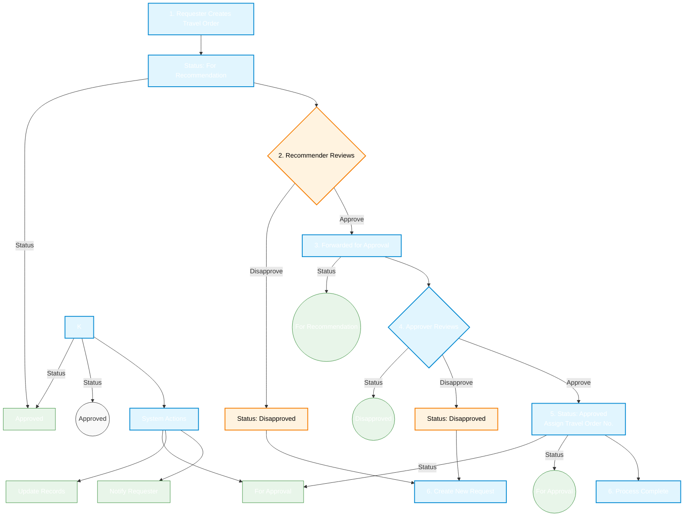

# Travel Order Management System - Workflow

## 1. Complete Workflow



## 2. Step-by-Step Process

### 2.1 Create Travel Order (Requester)
1. **Submit New Request**
   - Fill out travel order form
   - Attach necessary documents
   - Submit for processing
   - System sets status to "For Recommendation"

### 2.2 Recommendation Phase
1. **Recommender Review**
   - Receives notification of new request
   - Reviews travel order details
   - Makes decision:
     - **Approve**: Forwards to approver
     - **Disapprove**: Rejects request
   - If disapproved:
     - Status set to "Disapproved"
     - Requester must create new request

### 2.3 Approval Phase
1. **Approver Review**
   - Receives notification of forwarded request
   - Conducts final review
   - Makes decision:
     - **Approve**: Final approval
     - **Disapprove**: Reject request
   - If approved:
     - System generates unique travel order number
     - Status set to "Approved"
   - If disapproved:
     - Status set to "Disapproved"
     - Requester must create new request

## 3. Status Flow

```mermaid
stateDiagram-v2
    [*] --> ForRecommendation: 1. New Request
    
    state ForRecommendation {
        [*] --> Pending
        Pending --> Reviewed: 2. Recommender reviews
        Reviewed --> ForApproval: Approved
        Reviewed --> Disapproved: Disapproved
    }
    
    state ForApproval {
        [*] --> PendingApproval
        PendingApproval --> FinalReview: 4. Approver reviews
        FinalReview --> Approved: Approved
        FinalReview --> Disapproved: Disapproved
    }
    
    Approved --> [*]: 6. Process Complete
    Disapproved --> NewRequest: 6. Create New Request
    NewRequest --> [*]
    
    classDef default fill:#f9f9f9,stroke:#333,stroke-width:1px
    classDef pending fill:#fffde7,stroke:#fbc02d,stroke-width:2px
    classDef approved fill:#e8f5e9,stroke:#388e3c,stroke-width:2px
    classDef rejected fill:#ffebee,stroke:#c62828,stroke-width:2px
```
    class ForRecommendation,ForApproval pending
    class Approved approved
    class Disapproved rejected

## 4. Key Points

1. **Workflow Steps**
   1. Requester creates travel order
   2. Recommender reviews (Approve/Disapprove)
   3. If approved, moves to approver
   4. Approver reviews (Approve/Disapprove)
   5. If approved, assigns travel order number
   6. Process completes or new request needed

2. **Important Rules**
   - No editing after submission
   - Disapproved requests cannot be modified
   - New request required for any changes
   - Travel order number assigned only after final approval

## 5. Notifications

| Step | Event | Sent To | Method |
|------|-------|---------|--------|
| 1    | New Request Submitted | Recommender | Email, In-App |
| 2-3  | Recommendation Decision | | |
|      | • Approved | Approver | Email, In-App |
|      | • Disapproved | Requester | Email, In-App |
| 4-5  | Approval Decision | | |
|      | • Approved | Requester, Finance | Email, In-App |
|      | • Disapproved | Requester | Email, In-App |

## 6. Important Notes

1. **Request Creation**
   - Complete all required fields
   - Attach necessary documents
   - Review before submission
   - No changes allowed after submission

2. **Disapproved Requests**
   - Cannot be modified or resubmitted
   - New request must be created
   - Previous requests remain in system for reference

3. **Approval Process**
   - Strictly sequential (recommendation → approval)
   - No step can be skipped
   - All decisions are final
   - Full audit trail maintained
