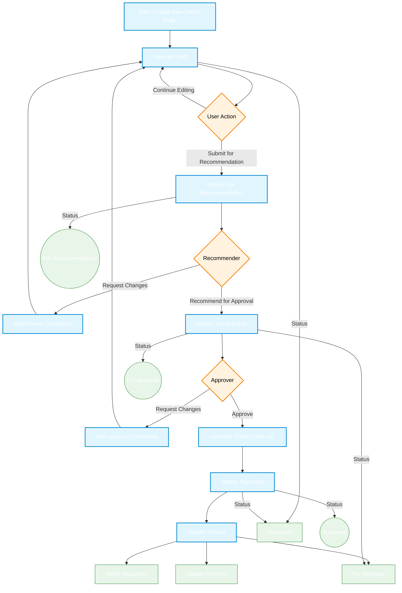

# Travel Order Management System - Workflow Documentation

## 1. Complete Workflow Diagram



## 2. Detailed Process Flow

### 2.1 Draft Creation & Submission
1. **Travel Order Creation**
   - User fills out the travel order form with:
     - Travel details (dates, destination, purpose)
     - Estimated budget
     - Supporting documents
   - System validates all required fields
   - Auto-saves as draft periodically

2. **Submission for Recommendation**
   - User reviews and submits the travel order
   - System:
     - Validates all required information
     - Updates status to "For Recommendation"
     - Locks the travel order from further edits
     - Notifies the assigned recommender

### 2.2 Recommendation Phase
1. **Review Process**
   - Recommender receives notification
   - Reviews travel order details
   - Can:
     - **Recommend for Approval**: Moves to next phase
     - **Request Changes**: Returns to user with comments
     - **View History**: See all previous actions

2. **Action on Recommendation**
   - If recommended:
     - Status changes to "For Approval"
     - Approver is notified
   - If changes requested:
     - Status reverts to "Draft"
     - User receives notification with comments
     - User can make changes and resubmit

### 2.3 Approval Phase
1. **Approval Process**
   - Approver reviews the travel order
   - Can:
     - **Approve**: Final approval
     - **Request Changes**: Returns for modification
     - **View Recommendation Notes**: See recommender's comments

2. **Approval Actions**
   - If approved:
     - System generates unique travel order number
     - Status changes to "Approved"
     - All related documents are stamped
   - If changes requested:
     - Returns to draft status
     - Detailed feedback provided

### 2.4 Post-Approval
1. **Notification & Documentation**
   - System sends approval notification to:
     - Requester
     - Finance department
     - HR department (if applicable)
   - Generates official documents:
     - Travel Order Form
     - Itinerary
     - Budget breakdown

2. **Record Keeping**
   - All actions are logged with:
     - Timestamp
     - User who performed the action
     - Comments/Notes
   - Full audit trail maintained

## 3. Status Lifecycle

### 3.1 Status Transition Diagram

```mermaid
stateDiagram-v2
    [*] --> Draft: New Travel Order
    
    state Draft {
        [*] --> Editing
        Editing --> Editing: Auto-save
        Editing --> Validation: Submit
        Validation --> Editing: Validation Failed
        Validation --> ForRecommendation: Valid
    }
    
    state ForRecommendation {
        [*] --> PendingReview
        PendingReview --> UnderReview: Opened by Recommender
        UnderReview --> ChangesRequested: Request Changes
        UnderReview --> ForApproval: Recommend
        ChangesRequested --> [*]
    }
    
    state ForApproval {
        [*] --> PendingApproval
        PendingApproval --> InReview: Opened by Approver
        InReview --> ChangesRequested: Request Changes
        InReview --> Approved: Approve
        ChangesRequested --> [*]
    }
    
    state Approved {
        [*] --> Processing
        Processing --> Active: Documents Generated
        Active --> Completed: Travel Completed
        Active --> Cancelled: If needed
    }
    
    %% Transitions
    Draft --> [*]: Delete
    ForRecommendation --> Draft: Withdrawn by User
    ForApproval --> Draft: Withdrawn by User
    
    %% Styling
    classDef startend fill:#4caf50,stroke:#2e7d32,color:white
    classDef draft fill:#2196f3,stroke:#0d47a1,color:white
    classDef review fill:#ff9800,stroke:#e65100,color:black
    classDef approved fill:#9c27b0,stroke:#4a148c,color:white
    classDef completed fill:#607d8b,stroke:#263238,color:white
    
    class Draft draft
    class ForRecommendation,ForApproval review
    class Approved approved
    class Completed completed
    class [*] startend

## 4. Additional Workflow Details

### 4.1 User Roles & Permissions

| Role | Permissions |
|------|-------------|
| Requester | Create, Edit, Submit, Withdraw, View own |
| Recommender | Review, Comment, Recommend, Request Changes |
| Approver | Approve, Reject, Request Changes, View all |
| Administrator | Full access, Override, Reporting |

### 4.2 Notification Matrix

| Event | Recipients | Channel |
|-------|------------|----------|
| Submitted for Recommendation | Recommender | Email, In-App |
| Recommendation Decision | Requester, Next Approver | Email, In-App |
| Approval Decision | Requester, Finance, HR | Email, In-App |
| Changes Requested | Requester | Email, In-App |
| Travel Order Approved | Requester, All Stakeholders | Email, In-App |

### 4.3 Error Handling

| Scenario | Action |
|----------|--------|
| Validation Failure | Show specific error messages |
| Missing Approver | Escalate to backup approver |
| System Error | Log details, notify admin, allow retry |
| Data Conflict | Show warning, allow resolution |

### 4.4 Performance Considerations

- All status changes are processed asynchronously
- Heavy operations (document generation) are queued
- Frequent auto-saves don't block user interaction
- Notifications are batched for better performance

## 5. Implementation Notes

1. **Audit Trail**
   - Every action is logged with:
     - User ID
     - Timestamp
     - IP Address
     - Action details
     - Before/after values (if applicable)

2. **Security**
   - Role-based access control
   - Data validation at all levels
   - Input sanitization
   - CSRF protection
   - Rate limiting

3. **Scalability**
   - Database indexing for frequent queries
   - Caching of frequently accessed data
   - Queue system for background jobs
   - Horizontal scaling support
