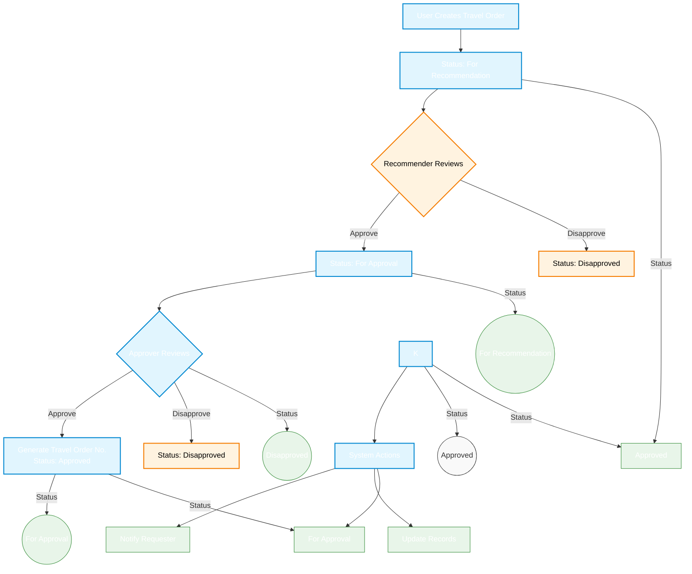

# Travel Order Management System - Workflow

## 1. Simplified Workflow



## 2. Process Steps

### 2.1 Create Travel Order
1. **User Submits Request**
   - Fill out travel details
   - Attach required documents
   - Submit for processing
   - System sets status to "For Recommendation"

### 2.2 Recommendation Phase
1. **Recommender Reviews**
   - Reviews the travel order
   - Options:
     - Approve → Moves to approver
     - Disapprove → Request is rejected
   - If disapproved:
     - Status: Disapproved
     - User must create new request

### 2.3 Approval Phase
1. **Approver Reviews**
   - Reviews the recommended travel order
   - Options:
     - Approve → Generates travel order number
     - Disapprove → Request is rejected
   - If approved:
     - System assigns travel order number
     - Status: Approved
   - If disapproved:
     - Status: Disapproved
     - User must create new request

## 3. Status Flow

```mermaid
stateDiagram-v2
    [*] --> ForRecommendation: New Request
    
    state ForRecommendation {
        [*] --> Pending
        Pending --> Reviewed: Recommender reviews
        Reviewed --> ForApproval: Approved
        Reviewed --> Disapproved: Rejected
    }
    
    state ForApproval {
        [*] --> PendingApproval
        PendingApproval --> Reviewed: Approver reviews
        Reviewed --> Approved: Approved
        Reviewed --> Disapproved: Rejected
    }
    
    Approved --> [*]: Process Complete
    Disapproved --> [*]: Request Closed
    
    classDef default fill:#f9f9f9,stroke:#333,stroke-width:1px
    classDef pending fill:#fffde7,stroke:#fbc02d,stroke-width:2px
    classDef approved fill:#e8f5e9,stroke:#388e3c,stroke-width:2px
    classDef rejected fill:#ffebee,stroke:#c62828,stroke-width:2px
    
    class ForRecommendation,ForApproval pending
    class Approved approved
    class Disapproved rejected

## 4. Key Points

1. **Simple Status Flow**
   - For Recommendation → For Approval → Approved/Disapproved
   - No draft or edit after submission
   - New request needed if disapproved

2. **User Actions**
   - Create new travel order
   - Submit for processing
   - Create new request if disapproved

3. **System Actions**
   - Assign status
   - Notify relevant parties
   - Generate travel order number when approved
   - Maintain audit trail

## 5. Notifications

| Event | Sent To | Method |
|-------|---------|--------|
| New Submission | Recommender | Email, In-App |
| Recommendation Approved | Approver | Email, In-App |
| Recommendation Disapproved | Requester | Email, In-App |
| Travel Order Approved | Requester, Finance | Email, In-App |
| Travel Order Disapproved | Requester | Email, In-App |

## 6. Important Notes

1. **No Edits After Submission**
   - Once submitted, requests cannot be modified
   - Create new request if changes are needed

2. **Disapproved Requests**
   - Cannot be resubmitted
   - New request must be created
   - Previous request kept for reference

3. **Approval Process**
   - Sequential flow (recommendation → approval)
   - No skipping of steps
   - Clear audit trail maintained
