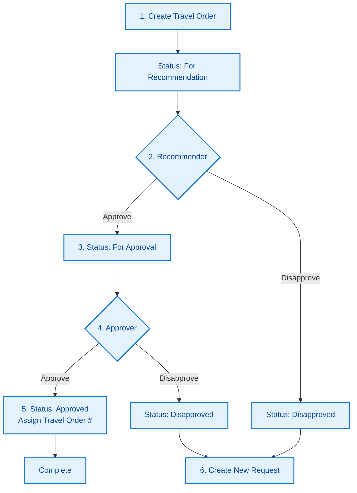
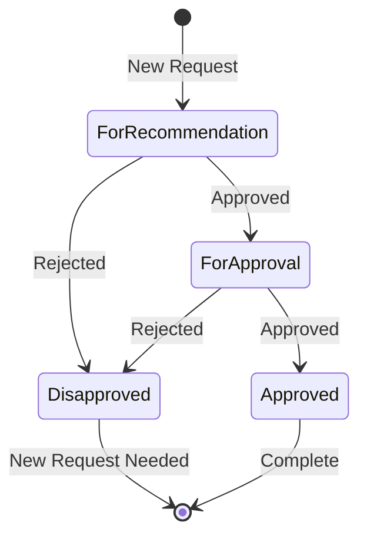

# Travel Order Management System - Workflow

## 1. Workflow Overview

## 2. Process Steps

### 2.1 Create Travel Order
1. **Requester**
   - Complete travel details
   - Attach required documents
   - Submit for recommendation
   - Status: For Recommendation

### 2.2 Recommendation Phase
1. **Recommender**
   - Reviews the request
   - **Approve**: Moves to approver
   - **Disapprove**: Rejects request
   - If disapproved:
     - Status: Disapproved
     - New request needed

### 2.3 Approval Phase
1. **Approver**
   - Reviews the request
   - **Approve**: 
     - Assigns travel order #
     - Status: Approved
   - **Disapprove**: 
     - Status: Disapproved
     - New request needed

## 3. Status Flow

## 4. Key Rules

1. **No Edits**
   - Cannot modify after submission
   - Create new request for changes

2. **Disapproved Requests**
   - Cannot be modified
   - New request required

3. **Approval**
   - Sequential (recommender → approver)
   - Travel order # assigned at final approval

## 5. Notifications

| When | Who | What |
|------|-----|------|
| New Request | Recommender | Review request |
| Approved by Recommender | Approver | Review request |
| Disapproved | Requester | Create new request |
| Approved | Requester, Finance | Travel order # assigned |

## 6. Process Notes

1. **For Requesters**
   - Double-check all details before submission
   - Keep copies of submitted documents
   - Create new request if rejected

2. **For Approvers**
   - Review all details carefully
   - Provide clear reason if rejecting
   - Verify travel order # is assigned

3. **System**
   - Maintains complete audit log
   - Tracks all status changes
   - Ensures sequential approval
