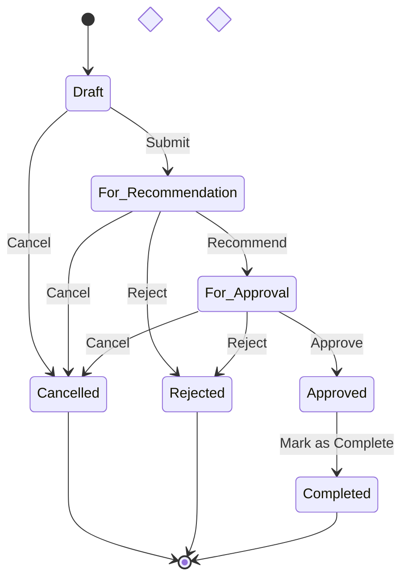

# Travel Order Workflow

## Overview

This document outlines the complete workflow of a travel order from creation to completion in the DENR Travel Order System. The workflow is designed to be flexible yet structured, ensuring proper authorization and documentation at each stage.

## Workflow States

### Main Statuses
1. **Draft** - Initial state when creating a new travel order
2. **For Recommendation** - Submitted and awaiting recommender's action
3. **For Approval** - Recommended and awaiting approver's action
4. **Approved** - Fully approved with travel order number assigned
5. **Rejected** - Rejected by either recommender or approver
6. **Cancelled** - Cancelled by creator or admin
7. **Completed** - Travel has been completed and documented

### Status Transitions

### Status Details

#### 1. Draft
- **Description**: Initial state when creating a new travel order
- **Allowed Actions**:
  - Edit all fields
  - Save as draft
  - Submit for recommendation
  - Delete (if no dependencies)
- **Who Can Modify**: Creator, Admin
- **Notification**: None

#### 2. For Recommendation
- **Description**: Submitted and waiting for recommender's action
- **Allowed Actions**:
  - View details
  - Add recommendation
  - Reject with reason
  - Cancel (creator/admin only)
- **Who Can Modify**: Recommender, Admin
- **Notification**: Email to recommender

#### 3. For Approval
- **Description**: Recommended and waiting for approver's action
- **Allowed Actions**:
  - View details
  - Approve with travel order number
  - Reject with reason
  - Request revision
  - Cancel (admin only)
- **Who Can Modify**: Approver, Admin
- **Notification**: Email to approver

#### 4. Approved
- **Description**: Fully approved with official travel order number
- **Allowed Actions**:
  - View details
  - Download/print travel order
  - Mark as completed
  - Cancel (admin only)
- **Who Can Modify**: Admin
- **Notification**: Email to creator

#### 5. Rejected
- **Description**: Rejected by recommender or approver
- **Allowed Actions**:
  - View details and rejection reason
  - Resubmit (creates new version)
  - Delete (admin only)
- **Who Can Modify**: Creator, Admin
- **Notification**: Email to creator with rejection reason

#### 6. Cancelled
- **Description**: Cancelled by creator or admin
- **Allowed Actions**:
  - View details
  - Restore (admin only)
  - Delete (admin only)
- **Who Can Modify**: Admin
- **Notification**: Email to all involved parties

#### 7. Completed
- **Description**: Travel has been completed
- **Allowed Actions**:
  - View details
  - Download/print completion report
  - Reopen (admin only)
- **Who Can Modify**: Admin
- **Notification**: Email to creator and approver

## Detailed Workflow Process

### 1. Travel Order Creation
- **Who**: Any authenticated user with `create travel orders` permission
- **Prerequisites**:
  - Valid user account
  - Complete employee profile
  - E-signature on file (if required)
- **Required Fields**:
  - Travel purpose (min. 20 characters)
  - Destination (with complete address)
  - Start and end dates/times
  - Mode of transportation
  - Estimated expenses (if applicable)
  - Recommender selection
  - Approver selection
- **Validations**:
  - Departure date ≥ current date + 1 business day
  - Arrival date ≥ departure date
  - Required fields completed
  - No date conflicts with existing approved travel
  - Recommender and approver are different and active
- **System Actions**:
  - Generate tracking number
  - Set initial status to 'Draft'
  - Log creation event

### 2. Submission for Recommendation
- **Who**: Travel order creator
- **Actions**:
  - Review all details
  - Submit for recommendation
  - Attach supporting documents (if any)
- **System Validations**:
  - All required fields completed
  - No future-dated edits after submission
  - User has submission quota available (if applicable)
- **System Actions**:
  - Update status to 'For Recommendation'
  - Lock editing of certain fields
  - Send notification to recommender
  - Log submission event

### 3. Recommendation Phase
- **Who**: Assigned Recommender
- **Prerequisites**:
  - `recommend travel orders` permission
  - Active account
  - Not the creator of the travel order
- **Actions**:
  - Review travel order details
  - Verify information accuracy
  - Add recommendation notes (optional)
  - Attach e-signature
  - Recommend for approval or reject with reason
  - Choose to recommend or reject
- **Outcomes**:
  - Recommend: Moves to "For Approval"
  - Reject: Returns to creator with reason

### 4. Approval Phase
- **Who**: Assigned Approver
- **Prerequisites**:
  - `approve travel orders` permission
  - Active account
  - Not the creator or recommender of the travel order
- **Actions**:
  - Review travel order and recommendation
  - Verify all requirements are met
  - Attach e-signature
  - Approve with travel order number or reject with reason
  - Add approval notes (optional)
- **System Actions**:
  - Generate official travel order number
  - Update status to 'Approved'
  - Set approval date and time
  - Lock all fields from further editing
  - Send notification to creator and requester
  - Log approval event
  - Trigger any post-approval workflows

### 5. Travel Completion
- **Who**: Travel Order Creator or Admin
- **Actions**:
  - Submit completion report within 3 business days of return
  - Upload supporting documents (tickets, receipts, etc.)
  - Provide summary of accomplishments
  - Mark travel as completed
- **System Validations**:
  - Travel return date has passed
  - All required documents attached
  - Completion report meets requirements
- **System Actions**:
  - Update status to 'Completed'
  - Calculate actual expenses (if applicable)
  - Update user's travel history
  - Archive travel order and documents
  - Trigger any post-completion workflows
  - Send confirmation to all stakeholders

### 6. Rejection Process
- **Who**: Recommender, Approver, or Admin
- **Valid Reasons for Rejection**:
  - Incomplete information
  - Invalid travel dates
  - Budget constraints
  - Policy violation
  - Other (must specify)
- **Required Actions**:
  - Provide clear reason for rejection
  - Suggest corrections (if applicable)
  - Select appropriate rejection type
- **System Actions**:
  - Update status to 'Rejected'
  - Store rejection reason and details
  - Notify creator with rejection details
  - Allow resubmission with corrections
  - Log rejection event

### 7. Cancellation Process
- **Who**: Creator (before approval), Admin (anytime)
- **Valid Reasons for Cancellation**:
  - Change in travel plans
  - Budget reallocation
  - Emergency situations
  - Policy changes
- **Required Actions**:
  - Select cancellation reason
  - Provide additional details (if required)
  - Confirm cancellation
- **System Actions**:
  - Update status to 'Cancelled'
  - Record cancellation details
  - Notify all involved parties
  - Release any allocated resources
  - Log cancellation event

## Status Transitions

| From State | To State | Action Required | Who Can Perform |
|------------|----------|-----------------|------------------|
| Draft | For Recommendation | Submit | Creator |
| For Recommendation | For Approval | Recommend | Recommender |
| For Recommendation | Rejected | Reject | Recommender |
| Pending | For Approval | Recommend | Recommender |
| Pending | Rejected | Reject | Recommender |
| For Approval | Approved | Approve | Approver |
| For Approval | Rejected | Reject | Approver |
| Any | Cancelled | Cancel | Creator/Admin |
| Approved | Completed | Mark Complete | Creator/Admin |

## E-Signature Flow

1. **User Registration**
   - User must upload e-signature during registration
   - Signature is stored securely
   - Can be updated in profile settings

2. **Recommendation/Approval**
   - System requires e-signature verification
   - Signature is attached to the document
   - Timestamp and user details are recorded

## Notifications

- **Email Notifications**:
  - New travel order assigned (to Recommender)
  - Recommendation made (to Approver)
  - Approval/Rejection (to Creator)
  - Status changes

- **In-App Notifications**:
  - Dashboard alerts
  - Notification bell updates
  - Status change indicators

## Error Handling

- **Validation Errors**:
  - Date validations
  - Required fields
  - Role-based access controls

- **Workflow Errors**:
  - Invalid state transitions
  - Missing signatures
  - Permission issues

## Best Practices

1. Always verify user permissions before state transitions
2. Log all state changes with timestamps and user info
3. Provide clear feedback for invalid actions
4. Maintain audit trail of all actions
5. Validate all inputs before processing
