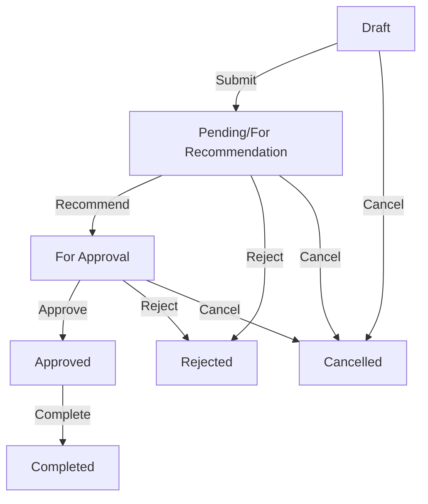

# Travel Order Workflow

## Overview

This document outlines the complete workflow of a travel order from creation to completion, including all possible states and transitions.

## Workflow States

1. **Draft** (Not yet submitted)
2. **Pending/For Recommendation** (Submitted, waiting for recommender)
3. **For Approval** (Recommended, waiting for approver)
4. **Approved** (Fully approved, travel order number assigned)
5. **Rejected** (Rejected by recommender or approver)
6. **Cancelled** (Cancelled by creator or admin)
7. **Completed** (Travel has been completed)

## Workflow Diagram

## Detailed Process

### 1. Travel Order Creation
- **Who**: Any authenticated user
- **Requirements**:
  - Valid travel details (dates, destination, purpose)
  - Select recommender (cannot be self)
  - Select approver (cannot be self or same as recommender)
  - E-signature on file
- **Validations**:
  - Departure date ≥ current date + 1 day
  - Arrival date ≥ departure date
  - Required fields not empty

### 2. Recommendation Phase
- **Who**: Assigned Recommender
- **Actions**:
  - Review travel order details
  - Attach e-signature
  - Choose to recommend or reject
- **Outcomes**:
  - Recommend: Moves to "For Approval"
  - Reject: Returns to creator with reason

### 3. Approval Phase
- **Who**: Assigned Approver
- **Actions**:
  - Review travel order and recommendation
  - Attach e-signature
  - Choose to approve or reject
- **Outcomes**:
  - Approve: System assigns travel order number, status changes to "Approved"
  - Reject: Returns to creator with reason

### 4. Post-Approval
- **Automatic Actions**:
  - Travel order number generation
  - Email notifications to all parties
  - Status update in system
- **Available Actions**:
  - Creator: Can mark as completed after travel
  - Admin: Can cancel if needed

## Status Transitions

| From State | To State | Action Required | Who Can Perform |
|------------|----------|-----------------|------------------|
| Draft | Pending | Submit | Creator |
| Pending | For Approval | Recommend | Recommender |
| Pending | Rejected | Reject | Recommender |
| For Approval | Approved | Approve | Approver |
| For Approval | Rejected | Reject | Approver |
| Any | Cancelled | Cancel | Creator/Admin |
| Approved | Completed | Mark Complete | Creator/Admin |

## E-Signature Flow

1. **User Registration**
   - User must upload e-signature during registration
   - Signature is stored securely
   - Can be updated in profile settings

2. **Recommendation/Approval**
   - System requires e-signature verification
   - Signature is attached to the document
   - Timestamp and user details are recorded

## Notifications

- **Email Notifications**:
  - New travel order assigned (to Recommender)
  - Recommendation made (to Approver)
  - Approval/Rejection (to Creator)
  - Status changes

- **In-App Notifications**:
  - Dashboard alerts
  - Notification bell updates
  - Status change indicators

## Error Handling

- **Validation Errors**:
  - Date validations
  - Required fields
  - Role-based access controls

- **Workflow Errors**:
  - Invalid state transitions
  - Missing signatures
  - Permission issues

## Best Practices

1. Always verify user permissions before state transitions
2. Log all state changes with timestamps and user info
3. Provide clear feedback for invalid actions
4. Maintain audit trail of all actions
5. Validate all inputs before processing
